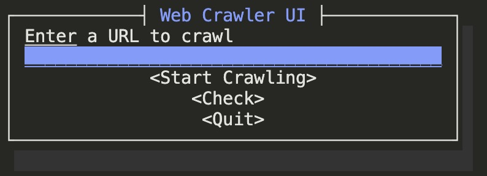
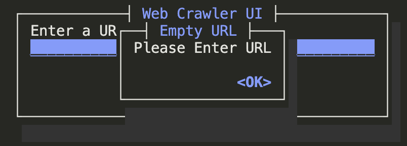
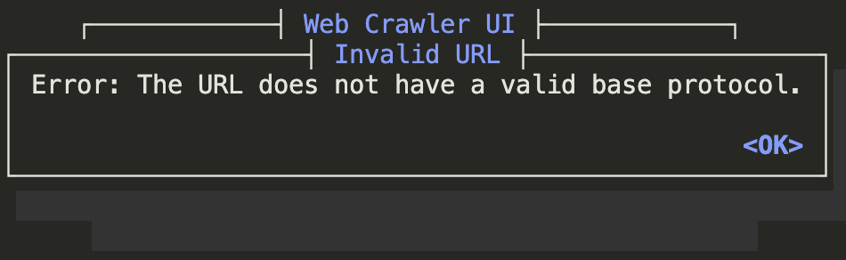
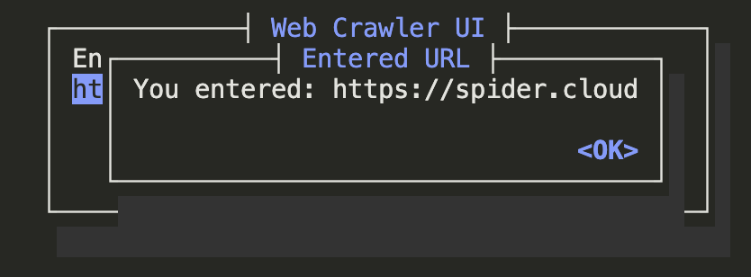
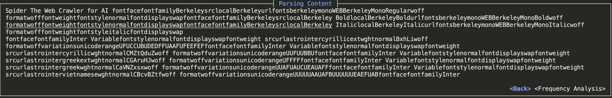
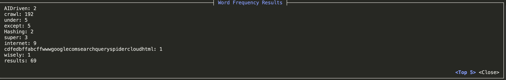
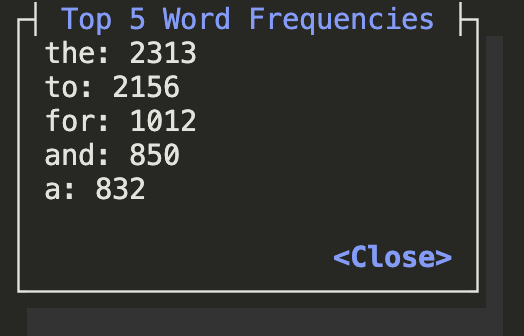

# **Web Crawler with Data Analysis Final Report**

- Hengda Xu, 1004749631

## **Table of Contents**
1. [Motivation](#motivation)
2. [Objective and Key Features](#objective-and-key-features)
3. [Reproducibility](#reproducibility)
4. [Future Plan](#future-plan)
5. [Contributions](#contributions)
6. [Video Demo](#video-demo)

## **Motivation**

In today, the rapid growth of information has made "data-driven decision-making"([`DDDM`](https://www.ibm.com/think/topics/data-driven-decision-making)) more important than ever. Whether mining large volumes of data for analysis, monitoring competitors' products, or aggregating news from various sources, the ability to collect data quickly and efficiently has become a core requirement. Thus, `Web Crawlers` become a key tool for fulfilling these needs.

On the other hand, `Rust`, as one of the newest and most popular programming languages, is known for its high performance and robust safety features. Rust’s efficiency makes it particularly suitable for developing data acquisition tools. However, unlike `Python`, which has a mature ecosystem of web scraping and analysis tools, Rust is still relatively young in this area. 

Although Rust has some effective libraries for web scraping, like `reqwest` and `scraper`, and data analysis libraries such as `polars`, tools for integrating data collecting and analysis are scarce. This often requires developers to call separate libraries for fetching and analyzing data, leading to extra steps. 

Ultimately, We aim to create a fully functional tool for filling the gap of Rust's ecosystem in integration of data crawling and analysis.

## **Objective and Key Features**

### **Objective**

With a background in big data, we understand that data acquisition and analysis are both important. My goal is to develop an `efficient`, `user-friendly` web crawler by Rust that not only enables `data crawling` but also provides `analysis capabilities`, for reducing the operations between collection and analysis.

### **Key Features**

- **Asynchronous crawling using stackless coroutines to speed up data collection**

We used `spider`, a lightweight, multithreaded web crawler library developed by the Rust community to quickly crawl web content and links. It is designed to be efficient, easy to use, and flexible to handle small or large-scale crawling tasks. This module contains the `Website` and `Page`. We use `Website::new(url)` to create and store the crawl object, and use `website.get_pages()` to get the crawled page and its information. Next, we traverse the `Page` to extract the HTML text or links on the page.

We design an `async` function to implement the asynchronous crawler function. We used the `website.scrape()` method to scrape the page and keep the HTML raw content for parsing.

Also, we combined the contents of Assignment 3. The `Url` lib is used to detect the url entered by the user to determine whether the url is valid for crawling.

- **Data parsing and extraction using HTML parsers**

We use a lightweight and powerful Rust library, `scraper`, to focus on extracting and parsing data from HTML documents. We only extract the text content from the html. So we're filtering out all the `tags` in the html and just keeping the text content. And we process the text content, filtering out all the symbols and reserving only the words for later analysis.

- **Basic data analysis**

1. **Word Frequency Analysis**: In order to help users quickly identify keywords and popular topics, we perform word frequency analysis on the crawled data. This involves labeling text as individual words and counting the frequency of each word. By highlighting frequently occurring terms, users can gain insight into the main topics related to the extracted words.

2. **Extended function**: We can help users display the top five words that are used mostly on the crawling web.

- **Text User Interface**

By using the `Cursive` library, we develop an intuitive text-based user interface (`TUI`) for users to interactively view data analysis results. 

The `TUI` will display both the word frequency results and offer basic navigation and options.

## **Reproducibility**

After you download the unzip package from our git repository. Unzip the unzip package to any location. Use terminal `cd` command to go to the unzip file location.
```
cd ECE1724_WebCrawler/crawler
```
Then, use `cargo build` and `cargo run`(`cargo build` may take few minutes to compiling the libs). 
```
cargo build
cargo run
```
After `cargo run`, the UI will show on the terminal. On the main UI interface, there is a `Enter a URL to crawl` where user can input the url. 



Before starting crawl, we suggest you to check the url. Here are some error situation when you input an empty url or invalid url.




Here is the valid url that can start crawling (`https://spider.cloud`)



After clicking the `Start Crawling`, it will lead you to the paring result interface. Also, there are some error reports will inform you if meeting some problems during the crawling steps.



When there are no errors and data is displayed on the page, you can click the `Frequency Analysis` button in the lower right corner to perform frequency analysis.



Also, you can click the `Top 5` button to display the 5 words with the highest frequency.



If you want to go back previous interface, just click the `close` button, `back` button or `ok` button.

Please refer to the video for detailed instructions of how to use the tool.

### Design Pattern and Extensibility
We refer to the MVC template and divide the functionality of the entire application into different parts. For the convenience of future extensions, we implement different functions in different files, which are `crawler.rs`, `parser.rs`, `analyzer.rs`, `ui.rs` and `main.rs`.


## **Future Plan**

In the future, we will try to extend the existing features.
We will consider adding multiple interfaces to truly implement asynchronous crawling. More specifically, we will design multiple crawl pages to allow users to crawl multiple pages at the same time.
Secondly, we will consider adding more parsing functionality to the different web types such as dynamic, video and audio sites.
And then we'll expand to include more analytical capabilities like sentiment analysis.
Finally, we think about enriching the UI to make the UI more beautiful, clear and easy to use.

## **Contributions**

Since my teammates had dropped this course, all works are done by myself.

## **Video Demo**
https://drive.google.com/file/d/15cJbSSwgFxNFxPOZfXjIq7D6TOJd1cYl/view?usp=sharing